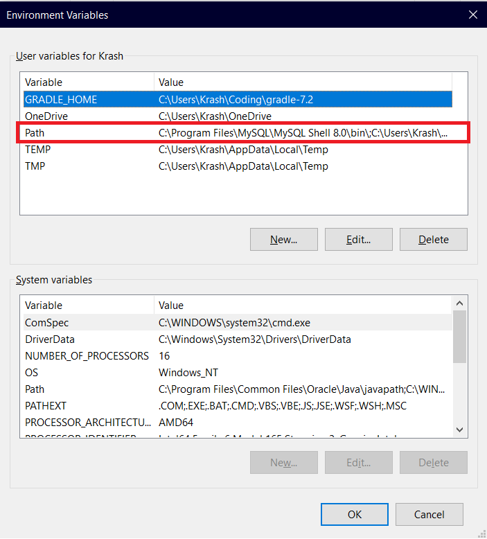
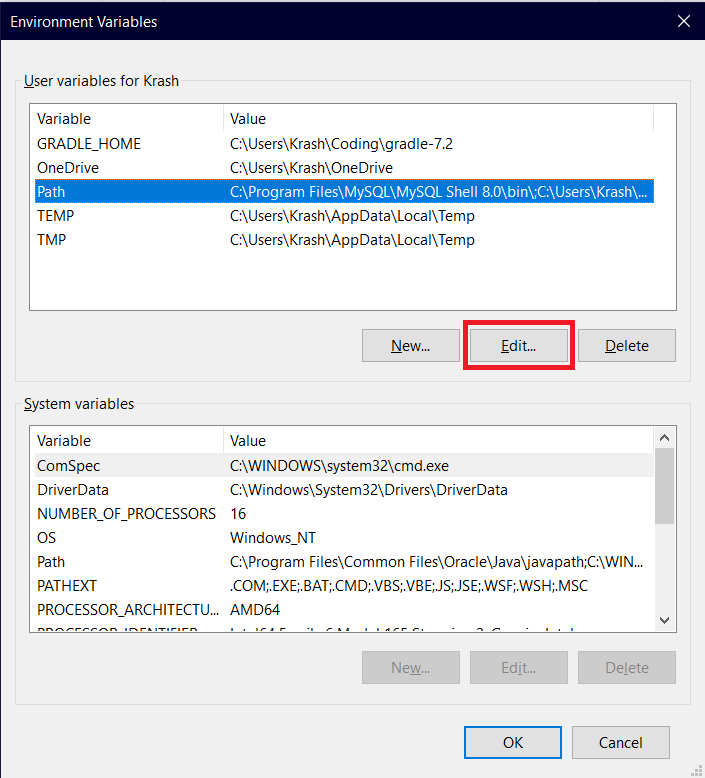
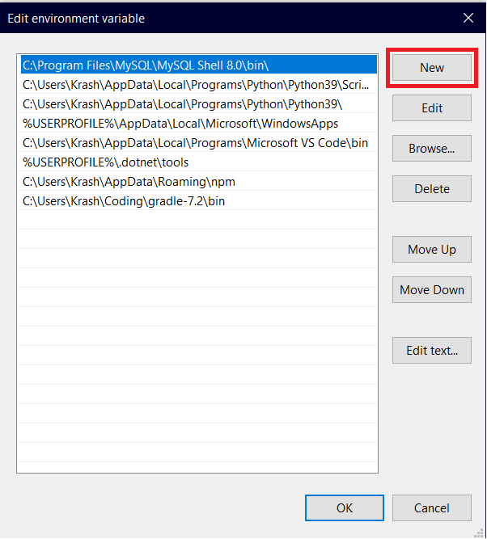
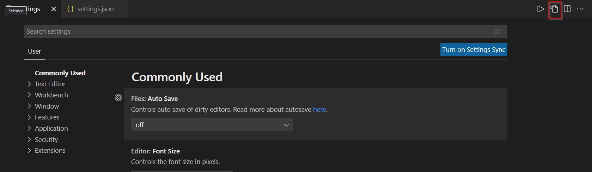

# Installation guide for VS Code on Windows

## 1) [VS Code Download](https://code.visualstudio.com/download)

## 2) Add [the C/C++ extension](https://marketplace.visualstudio.com/items?itemName=ms-vscode.cpptools) for code formatting and intellisense

press **Ctrl + Shift + x** in VSCode to open the extension tab and download the extensions from there

**Shortcut for formatting page: Ctrl + Alt + F**

[optional]: enable auto formatting  - Open the Settings tab (Ctrl + ,) and search for `format on type` and check the option

## 3) [Install compiler Mingw-w64](https://sourceforge.net/projects/mingw-w64/files/Toolchains%20targetting%20Win32/Personal%20Builds/mingw-builds/installer/mingw-w64-install.exe/download)
**!!!Important!!!**
After you have chosen a destination folder for mingw, make sure to copy the path somewhere.
We will need it for later.

## 4) Set up environmental variable(For Windows users)
1. Open your search tab
2. Search for `edit environment variables for your account`


3. Click on `Path` in the user variables tab


4. Click on `Edit`


5. Add a new path by clicking on `New`


6. Paste the path from the last step and add *'\bin'* at the end of the path
7. You are all set!

## 5) [Optional] If you don't want to run programs via terminal

Install [the Code Runner extension](https://marketplace.visualstudio.com/items?itemName=formulahendry.code-runner).

Open the Settings tab (Ctrl + ,).
Open the Code Runner settings .json file:

add these lines in order to compile with the button and save all files before run:
```json
"code-runner.executorMap": {
        "cpp": "g++ $fileName -o $fileNameWithoutExt && $fileNameWithoutExt"
    },
"code-runner.saveAllFilesBeforeRun": true
```

Now you can compile with the triangle run button!


You're ready to go :)

## Commands for compiling via terminal

- g++ $filename - compiles the code and creates exe with name `a`
- a - runs the exe compiled from the previous command
- g++ $filename -o $exefilename - compiles the code and creates exe with name `exefilename`